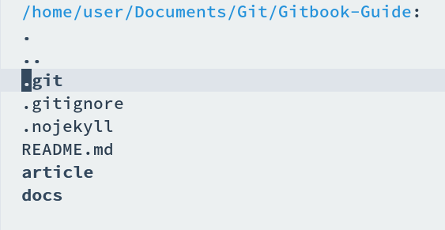
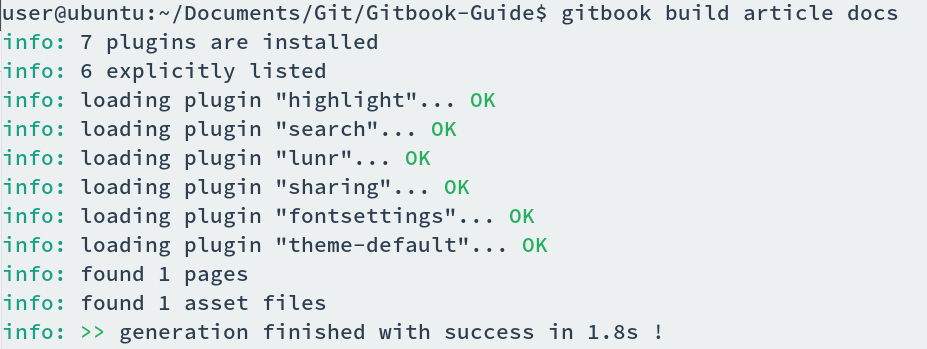
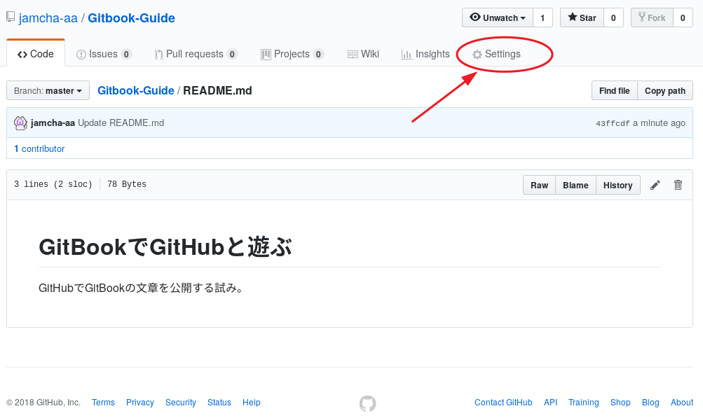
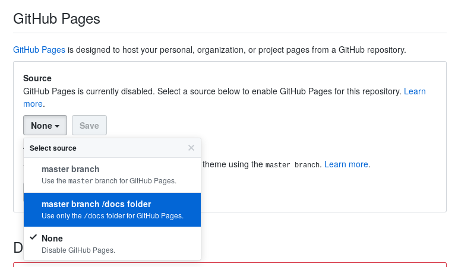
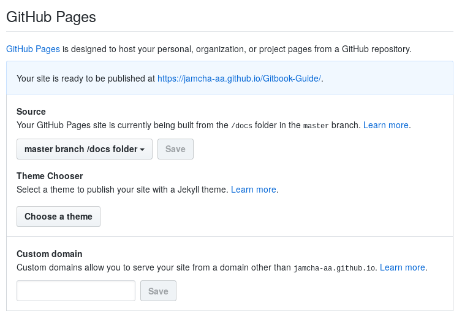

# 03 - 四種の神器

「これでもう必要なツールは揃ったのか？」EeePCが聞いてきた。「うん。あとはGitHubの仕様にあわせてファイルを作れば公開できる」「じゃあその方法を説明してもらおうか」  

私はdiredでリポジトリを開いた。  

   
  

「前にcloneしたときはREADMEだけだったが」「アイテムが4つ増えてるでしょ」「うむ」「ひとつずつ説明していくね」  

## .gitignore

「これは飛ばしてもいいでしょ」「一応説明してもらおうか」「Gitに無視してほしいファイルをここに書く」「たとえば？」「秘密の日記とか」「そんなの書いているのか？」「書かないの？」「さあな」「中身はこんな感じ」  

    node_modules
    _book

## .nojekyll

「これを入れないとGitHubがJekyllを読みこんじゃう」「Jekyllとはなんだ」「ブログツールみたいなものかな」「中身がカラだがいいのか？」「うん。.nojekyllって名前のファイルだけあればOK」  

## articleとdocs

「articleには原稿を入れてね」「docsは？」「原稿をGitBookにしたもの。GitBookが勝手に作ってくれる」「じゃあdocsは作らなくてもいいのか？」「ううん。初回に空のフォルダだけ作っておいて」「ふむ」  

「あ，ひとつ補足なんだけど」「なんだ」「articleの名前は何でもいいよ。srcとか」「じゃあ何でarticleなんだ？」「TeXの名残りです」「特に意味はないんだな」「ねえ，人の話聞いてる？」  

    README.md
    SUMMARY.md

「おい，articleの中にもREADMEがあるぞ」「そう。そっちのREADMEが表紙になる」「上のフォルダにあるREADMEとは違うのか？」「一緒でもいいよ。SUMMARYは目次。書き方はこんな感じ」  

[https://toolchain.gitbook.com/pages.html](https://toolchain.gitbook.com/pages.html)  

    * [GitBookでGitHubと遊ぶ](README.md)
    
    - [01 - 嵐の前触れ](01.md)
    - [02 - Love と Happy](02.md)

## いざ gitbook build

「それじゃあgitbookでビルドしてみようか」私はそう言ってターミナルを起動する。「マウスで気軽に操作，というわけにはいかないのか」「[GitBook Editor](https://legacy.gitbook.com/editor) とか？」「それだ」「君のスペックじゃ無理かな」「…」「ほら，落ち込まないの。ビルドするよ」  

    $ gitbook build article docs

   
  

「これで完成か？」「あっというまでしょ」「うむ」「docsフォルダにできあがったファイルがあるから，docsごとGitHubにアップロードすれば準備完了でござる」「それでもう見れるのでござるか？」「あと一手間ござる」「さようでござるか」「…」「なに顔を赤くしている。私が調子に乗っているとそんなに面白いのか」  

   
  

   
  

   
私のリポジトリのsettingタブをスクロールすると，GitHub Pagesの項目が現れる。「これを真ん中のdocsフォルダにしてSaveすればおしまい」「さっきフォルダの名前をdocsにしていたのはこれが理由か」「そうそう」「これは毎回設定する必要はないんだな？」「うん。初回だけ」  

   
  

「それでできあがったページはどこで見れるんだ？」「いま君が見ているのがそのページだよ」「おお」  

   
   
(c) 2018 jamcha (jamcha.aa@gmail.com).  

  

