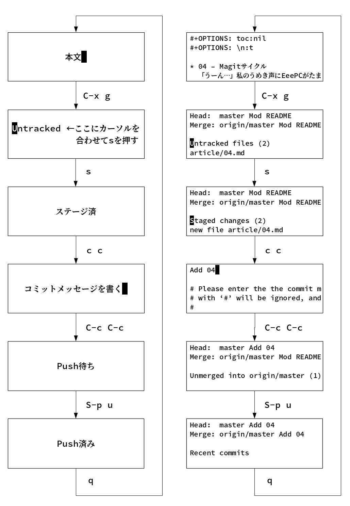

# 04 - Magitサイクル

「うーん…」私のうめき声にEeePCがたまらず声をかける。「今回は冗談がきかなそうだな」「うん」「何だ，言ってみろ」EeePCの問いかけに私は黙ったまま答えない。  

私の普段とは違う表情にEeePCも多少身構える。「遠慮するな。真面目に聞いてやる」「うーん…」考えあぐねた私は仕方なく打ち明けることにした。  

「私が苦労しないでGitHubにコミットできていることを伝えたい」それを聞いたEeePCは呆気に取られたようだ。「もう言ったんだからそれで終わりじゃないのか？」「違うの。言いたいのはそういうことじゃなくて」  

私は真剣な目で言う。「プログラムの苦手な私がまがりなりにもGitで数千コミットできているということは，一般に[難しい](https://gist.github.com/dukeofgaming/2150263)といわれるGitの理解を促進する要因が過去の学習プロセスに介在していた可能性がある」EeePCも応じる。「その発言はLinus自身が2015年のインタビューで[否定](https://jp.linux.com/news/linuxcom-exclusive/428524-lco2015041401)している。そもそも君がプログラムが苦手であるという前提自体が誤りである可能性もある」  

「ほんと？」思わず私の顔がほころぶ。「待て。論理の話をしただけだ。私は別に…」「ねえ，私プログラムできる人なの？」「苦手かどうかとできるかどうかは別問題だ」EeePCは心なく突き放す。だがすぐにつけ加えた。「ただ，君がこれまでわからなかったものがわかるようになったこと，その仕組みを理解すること自体には意義があるかもしれない。説明をしてくれ」  

それから私は自分が初心者向けのGit入門すら理解できず何度も挫折した過去を話した。EeePCは興味がなさそうだった。「それで，いつ変わったんだ？」「magitを使いはじめてから」「emacsのgitクライアントだな」「うん」「何が違ったんだ？」  

私の目が変わる。「進歩を感じた!」「ほう」「Git入門が難しいと思っていた理由は，バージョン管理っていう概念の理解と，Gitの操作を同時に要求されてたからだってわかったんだよ」「ふむ」「magitはそれ自体の使い方をまず知らないといけなくて」「ふむ」「その操作に慣れたらバージョン管理を学ぼうって感じ」「なるほど。二つの要因を順番に学ぶことで混乱を防いでいるわけだな」「うん。たとえばmagitでコミットとプッシュの手順をまとめるとこんな図になるんだけど」  

   
  

   
「なんだこれは」EeePCがあきれたように言う。「さっぱりでしょ？そこに実際の画面を並べるとこうなる」  

   
  

「全くわからん」「だから最初は操作するだけで精一杯なんだけど，実はそれが一番の近道なんだと思う。もっとわかりやすい方法があるのかもしれないけど，でも，自転車を初めて乗るときに，まずバランスを取る練習だけ続けて，それからペダルをこぐ，みたいな」  

> [一般的に git を学ぶ最適な方法は、最初はごく基本的なことだけを行い、基本を習熟して自信が持てるようになるまでは、その他のできることには目もくれないという方法です。 &#x2013; Linus Torvalds](https://jp.linux.com/news/linuxcom-exclusive/428524-lco2015041401)  

「それじゃあmagitに慣れた君はGitHubにコミットする方法もわかりやすく書き直してくれるんだろうな」EeePCが意地悪そうに言う。私は眉を寄せた。「うーん，上の画像とやってること同じなんだけど…」「それじゃあ質問を変えよう。magitを使うことの利点は？」「楽しいです!」「お，おう…」「ログとか修正箇所見たり，そこからブランチ切ったり，必要なアイテムだけステージングしたり，プッシュ前にコミットメッセージ書き直したり，思い切ってリセットしたり。たぶんターミナルでgit使ってたら全然わからなかったと思う」  

興奮気味に言う私。だがそれを聞いたEeePCは少し安心したようだった。「話を聞くかぎり，思い通りに使えているようだな」「まだ機能の1%も使えてないと思うけど，でも[一度慣れたらあまりの便利さに手放せなくなる](https://qiita.com/maueki/items/70dbf62d8bd2ee348274)のはそのとおりだと思う」  

   
EeePCはこれまでの話を見返してから言った。「GitBookで文書をビルドしたら，直接GitHubにアップロードしてもいいし，magitを使うこともできるわけだな」「そうそう。GitBookをインストールすればあとはご自由に」「君の場合はmagitに固執するわけだ」「固執って…選ぶって言ってよ」「マニュアルを見るとGitBookには他にもいろいろ機能があるみたいだが」「それは基本に慣れてからにしましょう」「magitみたいにか？」「そのとおり!」  

   
&#x2013; 了 &#x2013;  

   
   
(c) 2018 jamcha (jamcha.aa@gmail.com).  

  

