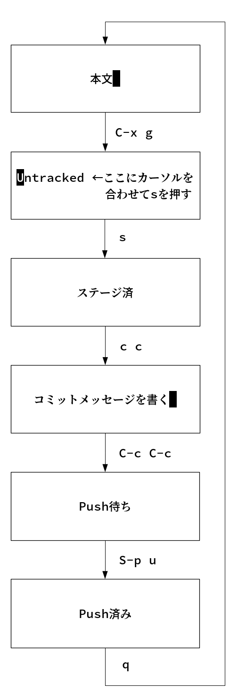

# 04 - Magitサイクル

「うーん…」私のうめき声にEeePCがたまらず声をかける。「ビオフェルミンなら薬箱に…」「ちがうよ!」「じゃあなんだ。正露丸か」「それも違う」「ガスピタン？」「冗談はやめて。本気で悩んでるんだから」「そんなに出てないのか」「だから違うって!」  

私の普段とは違う剣幕にEeePCも多少身構える。「相談してみろ」「うーん…」考えあぐねた私は仕方なく打ち明けることにした。  

「私が苦労しないでGitHubにコミットできていることを伝えたい」「もう言ったんだからそれで終わりじゃないのか？」「プログラムの苦手な私がまがりなりにもGitで数千コミットできているということは，一般に難しい ([Morton, 2007](https://gist.github.com/dukeofgaming/2150263)) といわれるGitの理解を促進するための要因が介在している可能性がある」「その発言はLinus自身が2015年のインタビューで[否定](https://jp.linux.com/news/linuxcom-exclusive/428524-lco2015041401)している。そもそも君がプログラムが苦手であるという前提自体が誤りである可能性もある」「ほんと？」思わず私の顔がほころぶ。  

   
  

   
   
(c) 2018 jamcha (jamcha.aa@gmail.com).  

  

